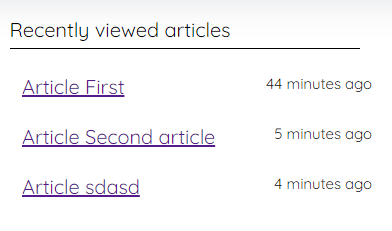

### docure-recently-viewed

```js
npm i @specialdoom/docure-recently-viewed dayjs
```

### usage

```html
<docure-recently-viewed userid="value" token="{token}"></docure-recently-viewed>
```

### example


